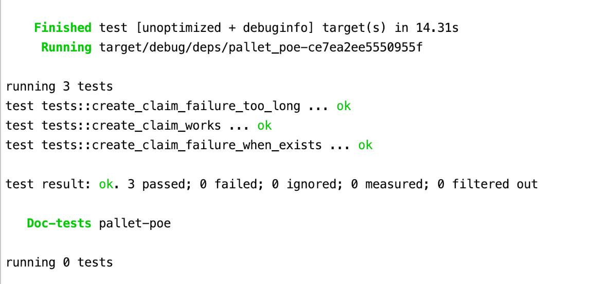
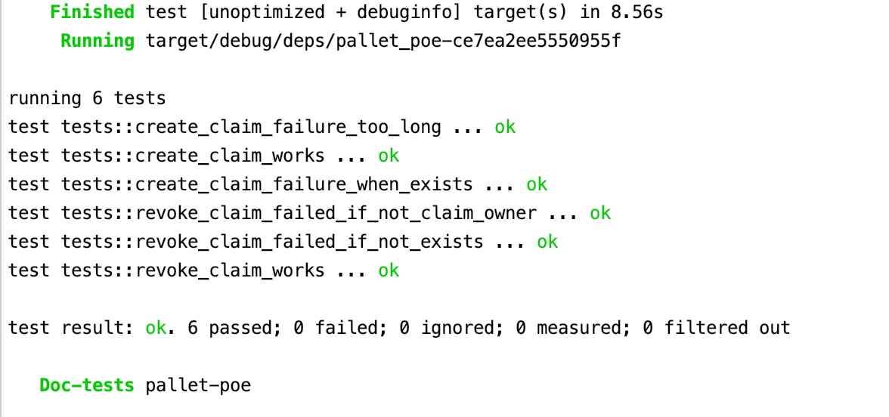
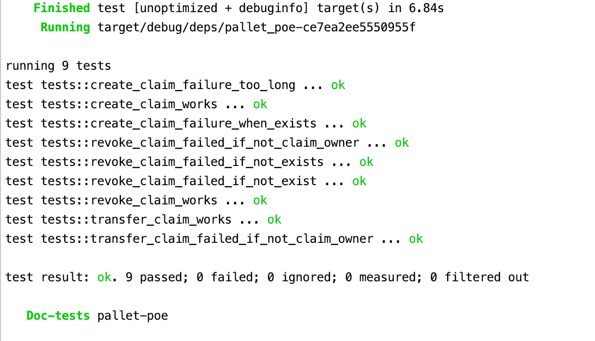
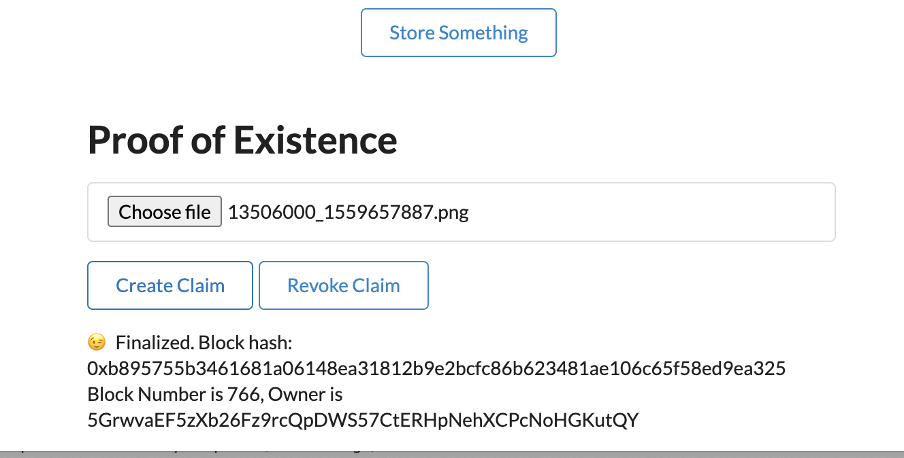
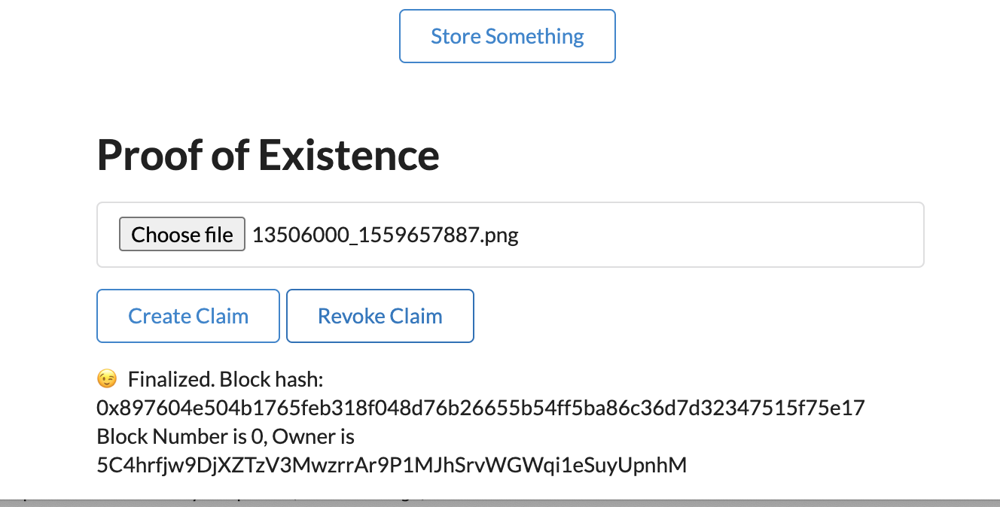
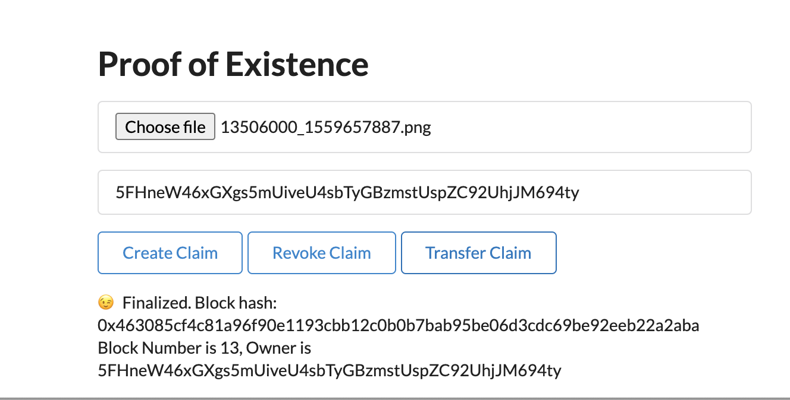
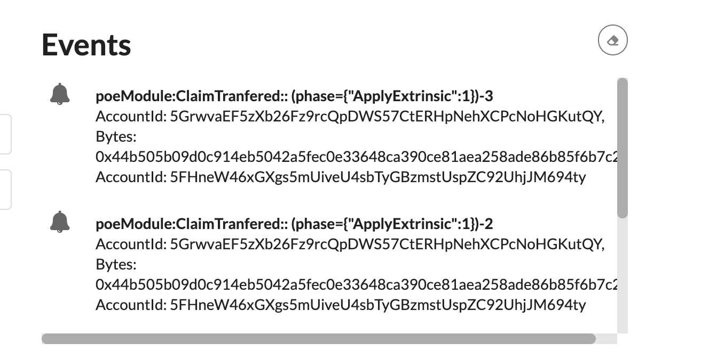
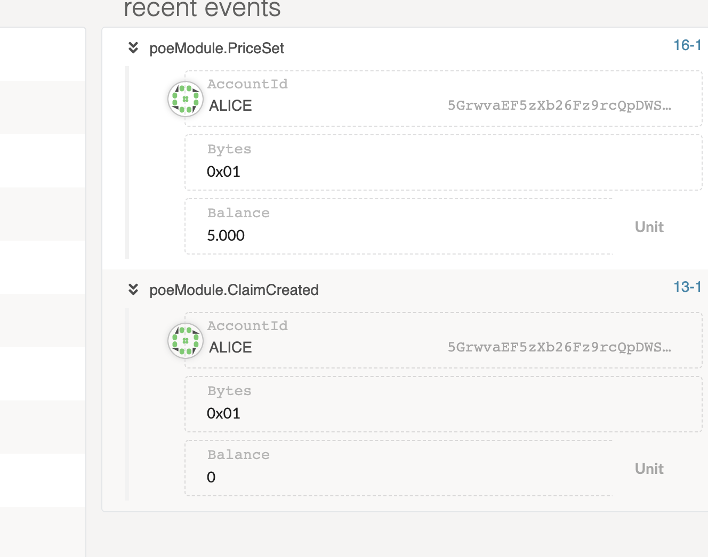
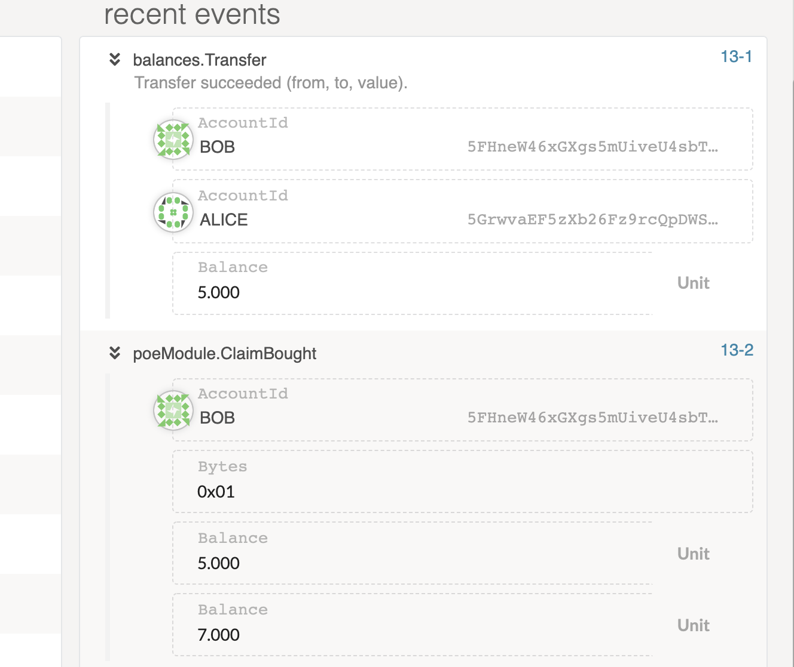

## 第三课作业 PoE 2

课程里会给出参考资料，大家一定要自己敲一遍**代码**！

注：

1. 提交源代码，运行`cargo test`的测试结果截图，前端 UI 的截图；
2. 测试应覆盖所有的业务逻辑，如不同的错误场景，以及一切正常的情况下，检查存储的数据是不是预期的那样。
3. 附加题不是必答的，但可以酌情加分。
4. 代码修改在本目录 substrate-node-template 和 substrate-front-end-template 的程序文件里。

第一题：编写存证模块的单元测试代码，包括：

- 创建存证的测试用例；

```
#[test]
fn create_claim_works() {
    // PoeModule::create_claim();
    new_test_ext().execute_with(|| {
        let claim = vec![1,2];
        assert_ok!(PoeModule::create_claim(Origin::signed(1), claim.clone()));
        assert_eq!(Proofs::<Test>::get(&claim), (1, system::Module::<Test>::block_number()));
    })
}

#[test]
fn create_claim_failure_when_exists() {
    new_test_ext().execute_with(|| {
        let claim = vec![1,2];
        assert_ok!(PoeModule::create_claim(Origin::signed(1), claim.clone()));
        assert_noop!(
            PoeModule::create_claim(Origin::signed(1), claim.clone()),
            Error::<Test>::ProofAlreadyExist
        );
    })
}

#[test]
fn create_claim_failure_too_long() {
    new_test_ext().execute_with(|| {
        let claim = vec![1,2,5,6,5,5,5,6,4,3];
        assert_noop!(
            PoeModule::create_claim(Origin::signed(1), claim.clone()),
            Error::<Test>::ProofTooLong
        );
    })
}
```

- 

* 撤销存证的测试用例；

```
#[test]
fn revoke_claim_works () {
    new_test_ext().execute_with(|| {
        let claim = vec![1,2];
        let _ = PoeModule::create_claim(Origin::signed(1), claim.clone());
        assert_ok!(PoeModule::revoke_claim(Origin::signed(1), claim.clone()));
    })
}

#[test]
fn revoke_claim_failed_if_not_exists () {
    new_test_ext().execute_with(|| {
        let claim = vec![1,2];

        assert_noop!(
            PoeModule::revoke_claim(Origin::signed(1), claim.clone()),
            Error::<Test>::ClaimNotExist);
    })
}

#[test]
fn revoke_claim_failed_if_not_claim_owner() {
    new_test_ext().execute_with(|| {
        let claim = vec![1,2];
        let _ = PoeModule::create_claim(Origin::signed(1), claim.clone());
        assert_noop!(
            PoeModule::revoke_claim(Origin::signed(2), claim.clone()),
            Error::<Test>::NotClaimOwner);
    })
}

```

- 

* 转移存证的测试用例；

```

#[test]
fn transfer_claim_works() {
    new_test_ext().execute_with(|| {
        let claim = vec![1,2];
        let _ = PoeModule::create_claim(Origin::signed(1), claim.clone());
        assert_ok!(PoeModule::transfer_claim(Origin::signed(1), claim.clone(), 2));
    })
}

#[test]
fn transfer_claim_failed_if_not_claim_owner() {
    new_test_ext().execute_with(|| {
        let claim = vec![1,2];
        let _ = PoeModule::create_claim(Origin::signed(1), claim.clone());
        assert_noop!(
            PoeModule::transfer_claim(Origin::signed(2), claim.clone(), 2),
            Error::<Test>::NotClaimOwner);
    })
}

#[test]
fn revoke_claim_failed_if_not_exist() {
    new_test_ext().execute_with(|| {
        let claim = vec![1,2];
        //let _ = PoeModule::create_claim(Origin::signed(1), claim.clone());
        assert_noop!(
            PoeModule::transfer_claim(Origin::signed(1), claim.clone(), 2),
            Error::<Test>::ClaimNotExist);
    })
}
```

- 

* 撤销存证的测试用例；
* 转移存证的测试用例；

第二题：编写存证模块的 UI，包括

- 创建存证的 UI
- 删除存证的 UI
- 转移存证的 UI

```
function Main (props) {
  const { api } = useSubstrate();
  const { accountPair } = props;

  // The transaction submission status
  const [status, setStatus] = useState('');
  const [digest, setDigest] = useState('');
  const [owner, setOwner] = useState('');
  const [blockNumber, setBlockNumber] = useState(0);
  const [dest, setDest] = useState('');
  const [price, setPrice] = useState(0);


  useEffect(() => {
    let unsubscribe;
    //debugger;
    api.query.poeModule.proofs(digest, (result) => {
      console.log(JSON.stringify(result))
      setOwner(result[0].toString());
      setBlockNumber(result[1].toNumber());
    }).then(unsub => {
      unsubscribe = unsub;
    })
      .catch(console.error);

    return () => unsubscribe && unsubscribe();
  }, [digest, api.query.poeModule]);


  const handleFileChosen = (file) => {
    const fileReader = new FileReader();

    const bufferToDigest = () => {
      const content = Array.from(new Uint8Array(fileReader.result))
        .map((b) => b.toString(16).padStart(2, '0'))
        .join('');

      const hash = blake2AsHex(content, 256);

      setDigest(hash);
    };

    fileReader.onloadend = bufferToDigest;

    fileReader.readAsArrayBuffer(file);
  };

  return (
    <Grid.Column width={8}>
      <h1>Proof of Existence</h1>
      <Form>
        <Form.Field>
          <Input
            type = 'file'
            id = 'file'
            lable = 'your file'
            onChange = {(e) => handleFileChosen(e.target.files[0])}
          />
        </Form.Field>
        {/* <Form.Field>
          <Input
            type = 'text'
            id = 'price'
            lable = 'set your price'
            onChange = {(e) => setPrice(e.value)}
          />

        </Form.Field> */}
        <Form.Field>
          <Input
            type = 'text'
            id = 'dest'
            placeholder = 'destination account'
            value = {dest}
            onChange = {(e) => setDest(e.target.value)}
          />

        </Form.Field>
        <Form.Field>
          <TxButton
            accountPair = {accountPair}
            label = 'Create Claim'
            setStatus = {setStatus}
            type='SIGNED-TX'
            attrs={{
              palletRpc: 'poeModule',
              callable: 'createClaim',
              inputParams: [digest],
              paramFields: [true]
            }}
          />
          <TxButton
            accountPair = {accountPair}
            label = 'Revoke Claim'
            setStatus = {setStatus}
            type='SIGNED-TX'
            attrs={{
              palletRpc: 'poeModule',
              callable: 'revokeClaim',
              inputParams: [digest],
              paramFields: [true]
            }}
          />
          <TxButton
            accountPair = {accountPair}
            label = 'Transfer Claim'
            setStatus = {setStatus}
            type='SIGNED-TX'
            attrs={{
              palletRpc: 'poeModule',
              callable: 'transferClaim',
              inputParams: [digest, dest],
              paramFields: [true]
            }}
          />

        </Form.Field>
          <div>{status}</div>
        <div>Block Number is {blockNumber}, Owner is {dest}</div>

      </Form>
    </Grid.Column>
  );
}

export default function PoeModule (props) {
  const { api } = useSubstrate();
  return (api.query.poeModule && api.query.poeModule.proofs
    ? <Main {...props} /> : null);
}
```

create claim ui

- 
  revoke claim ui
- 
  transfer claim ui
- 
- 

第三题（附加题）：实现购买存证的功能代码：

- 用户 A 为自己的某个存证记录设置价格；
- 用户 B 可以以一定的价格购买某个存证，当出价高于用户 A 设置的价格时，则以用户 A 设定的价格将费用从用户 B 转移到用户 A，再将该存证进行转移。如果出价低于用户 A 的价格时，则不进行转移，返回错误。

<<<<<<< HEAD
set price ui

- 
  claim bought ui
- # 
  > > > > > > > master
