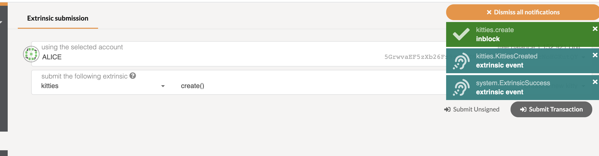
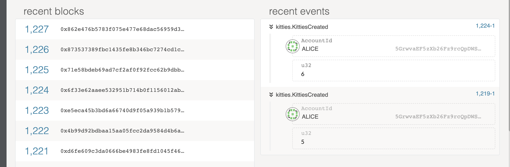
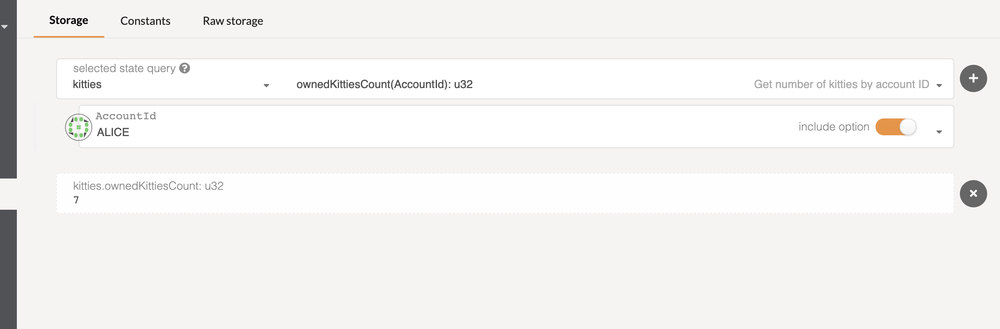
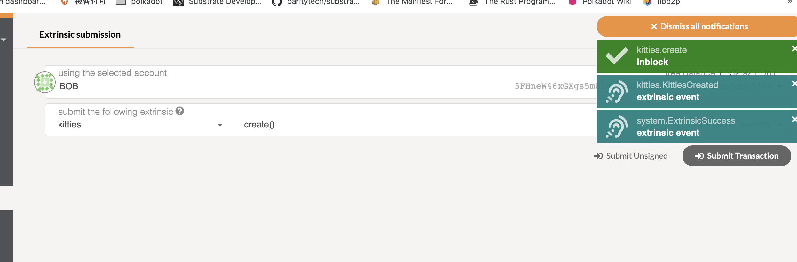
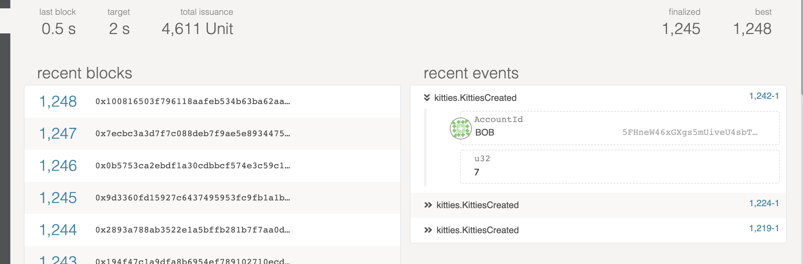
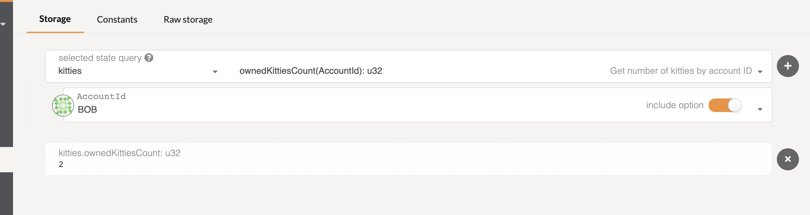
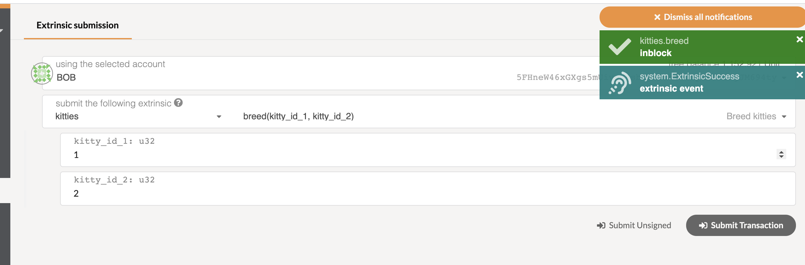
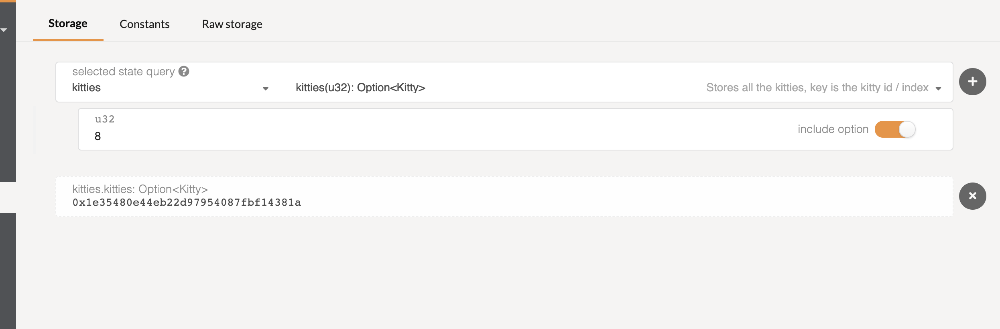

# Create Kitty

 - alice create kitty
  

 - alice create kitty result
  

 - alice owned kitties count
  

 - bob create kitty
  

  - bob create kitty result
  

  - bob owned kitties count
  

# Breed Kitty
  - breed kitty
  

  - breed kitty result
  

